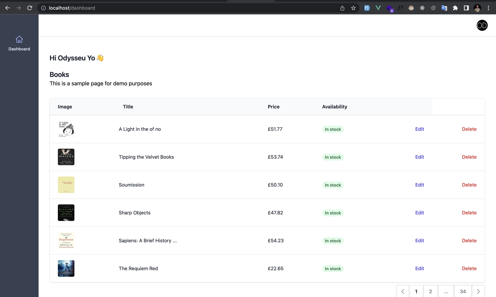

# Web Scraping and Data Management Application

## Introduction

This application allows users to scrape data from a website and save the results to a database. It also provides a simple frontend app for viewing the scraped data using Laravel for the backend and Vue.js for the frontend.

## Technologies Used

- Laravel for the backend
- Vue.js for the frontend
- SQL for database management
- Docker for containization

## Features

1. Login
- Users can log in with a username and password
- No forgot password functionality or user management interface is provided

2. Scraped Data List
- Sorted list of the scraped data is displayed
- The list is paginated for easy viewing
- Ability to edit the data (optional)
- Ability to delete the data (optional)

## Getting Started

1. Clone the repository
2. Run `./vendor/bin/sail up`
2. Run `./vendor/bin/sail composer install` to install Laravel dependencies
3. Run `./vendor/bin/sail npm install` to install Vue.js dependencies
4. Set up your database credentials in the `.env` file
5. Run `./vendor/bin/sail artisan migrate` to set up the database tables
7. Run `./vendor/bin/sail npm run dev`
7. Open a web browser and navigate to `http://localhost:80` to access the frontend app

## Testing

Tests for the application have been implemented using PHPUnit. To run the tests, execute `./vendor/bin/sail test`.

N/B

Many optimization techniques are intentionally disregarded. 
